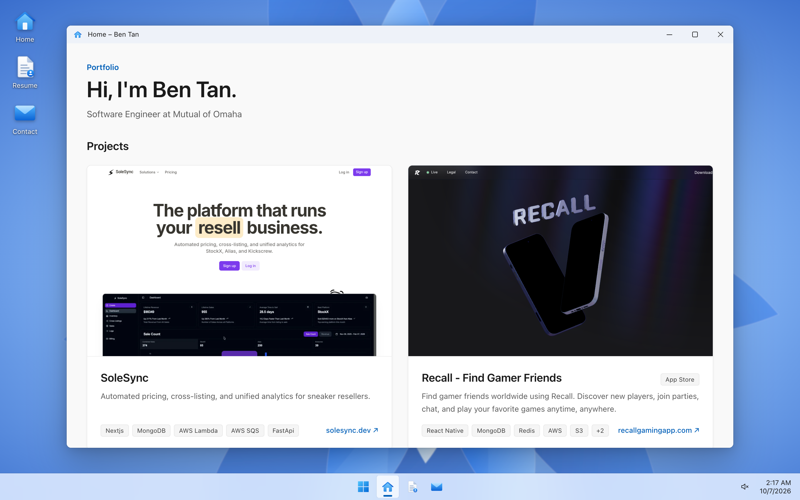
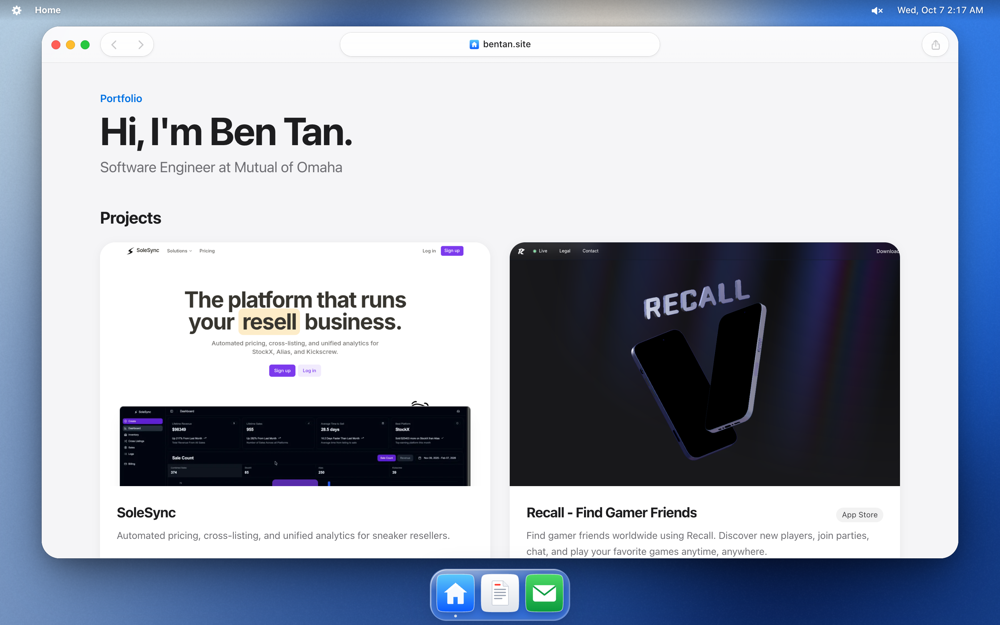

# Ben Tan Personal Site

A personal site with two switchable Window interface and MacOs interface

| Windows                                        | macOS                                      |
| ---------------------------------------------- | ------------------------------------------ |
|  |  |

The site renders Ben's resume and portfolio directly from files in `public/assets/`. It is built with Next.js, React, TypeScript, Tailwind CSS, and [Paper Shaders](https://github.com/paper-design/shaders).

## Getting started

Install dependencies and start the development server:

```bash
npm install
npm run dev
npm run dev -- -p 3123 /** use a different port */
```

### Resume

`public/assets/ben_tan_resume.tex` is the source of truth for the Resume and Home windows. It is parsed during development and at build time to extract contact details, the current role, skills, experience, and projects. Editing it requires a refresh in development or a new production build.

### About me

`public/assets/about.json` holds the About me section at the top of the Home window. Every field is optional; the section is hidden when the file is missing or empty. `photo` is a web image URL or a file name in `public/assets/` (keep it small, around 512px square).

```json
{
  "photo": "ben-2022.jpg",
  "intro": "I am currently a Software Engineer at Mutual of Omaha.",
  "skills": [{ "label": "Languages", "items": ["Python", "TypeScript", "Java"] }]
}
```

### Projects

`public/assets/projects.json` supplements the projects parsed from the resume. Entries are matched to resume projects by name.

```json
{
  "projects": [
    {
      "name": "SoleSync",
      "url": "https://solesync.dev",
      "repo": "https://github.com/example/repository",
      "description": "Optional card description",
      "image": "solesync-custom.png",
      "tag": "SaaS",
      "stack": ["Next.js", "MongoDB", "AWS"]
    }
  ]
}
```

Available fields:

| Field         | Purpose                                              |
| ------------- | ---------------------------------------------------- |
| `name`        | Required matching/display name                       |
| `url`         | Live project URL                                     |
| `repo`        | Source repository URL                                |
| `description` | Overrides the fetched site description               |
| `image`       | Web image URL or a filename in `public/assets/`      |
| `tag`         | Short badge, such as `App Store` or `SaaS`           |
| `stack`       | Overrides the technology list parsed from the resume |
| `hidden`      | Set to `true` to hide the project                    |

Custom images in `public/assets/` are served directly at `/assets/<filename>`. Generated website screenshots remain in `public/previews/`.

Because Next.js serves everything inside `public/`, the `.tex`, JSON, PDF, and images in `public/assets/` are publicly reachable from the deployed site. The app only parses the `.tex` file; it does not use the PDF.

## Commands

| Command                         | Purpose                                                |
| ------------------------------- | ------------------------------------------------------ |
| `npm run dev`                   | Generate missing previews and start development mode   |
| `npm run build`                 | Generate missing previews and create the static export |
| `npm run previews`              | Generate only missing project previews                 |
| `npm run previews -- --refresh` | Refresh project metadata and screenshots               |
| `npm run format`                | Format the repository with Prettier                    |
| `npm run format:check`          | Check formatting without changing files                |
| `npx tsc --noEmit`              | Type-check the project                                 |

## Git hooks

Installing dependencies runs Husky's `prepare` script and activates the repository hooks:

- `pre-commit` runs Prettier through `lint-staged` on supported staged files and adds the formatting changes back to the pending commit.
- `commit-msg` runs Commitlint with the Conventional Commits rules.

Commit messages should follow this format:

```text
<type>(optional-scope): short description
```

Examples include `feat: add project preview`, `fix(resume): parse optional links`, and `docs: update setup guide`.
